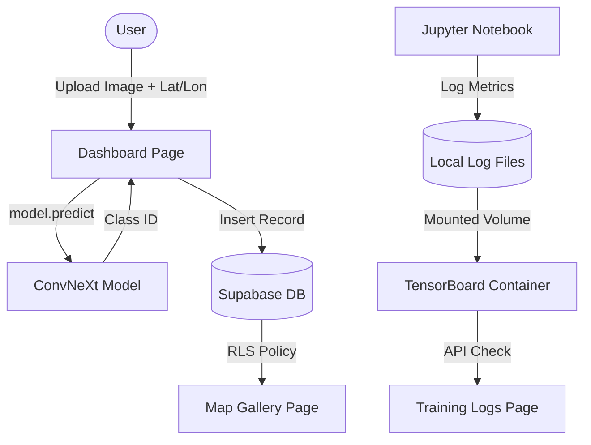

# Vadvilág - Technical Documentation

This document provides a detailed technical overview of the Vadvilág Dashboard application, focusing on the core functions, data flow, and architecture.

## Architecture Overview

The system is built as a multi-container Dockerized application:
- **`wildlife-dashboard`**: Dash (Python) web application.
- **`wildlife-tensorboard`**: TensorBoard service serving training metrics.
- **`supabase-*`**: Local Supabase stack (Auth, DB (Postgres), REST API).
- **`kong`**: API Gateway for Supabase services.

---

## Core Application Logic

### `app.py`

The entry point of the Dash application. It initializes the layout and handles global components like the navigation bar and authentication storage.

#### Function: `update_nav(auth_data)`
*   **Purpose**: Dynamically updates the top navigation bar based on the user's login state.
*   **Trigger**: Fires whenever the `auth-store` session data changes.
*   **Returns**: 
    *   **Authenticated**: Dashboard, Map Gallery, Training Logs, and Logout links.
    *   **Unauthenticated**: Login and Register links.

---

### `auth.py`

Contains helper functions for interacting with the Supabase Authentication service.

#### Function: `get_supabase_client(access_token=None)`
*   **Purpose**: Creates and returns a Supabase `Client` instance.
*   **Logic**: If an `access_token` is provided, it configures the client with the user's JWT to respect Row Level Security (RLS) policies.

#### Function: `sign_up(email, password)`
*   **Purpose**: Registers a new user via Supabase.
*   **Error Handling**: Returns user-friendly Hungarian messages for common issues (e.g., account already exists, password too short).

#### Function: `sign_in(email, password)`
*   **Purpose**: Authenticates a user and returns session tokens.
*   **Returns**: A dictionary containing `access_token`, `refresh_token`, and user details.

#### Function: `sign_out(access_token)`
*   **Purpose**: Ends the user's session globally.

---

### `classes.py`

A utility file containing a static list `CLASS_NAMES` with 594 scientific Latin names for wildlife species. This list mapping is used to translate the numeric output indices of the AI model into human-readable species names.

---

## Page Components

### `dashboard.py`

The primary interface for users to upload and classify wildlife photos.

#### Function: `update_output(contents, filename, ...)`
*   **Purpose**: The "Heart" of the classification flow.
*   **Process**:
    1.  Decodes the `base64` image data from the upload component.
    2.  Resizes the image to `224x224` pixels (compatible with ConvNeXtBase).
    3.  Runs the image through the Keras model (`wildlife_classifier_final.keras`).
    4.  Extracts the highest probability class and maps it via `CLASS_NAMES`.
    5.  **Data Persistence**: If latitude/longitude are picked from the map, it inserts a record into the `user_uploads` Table in Supabase.

#### Function: `update_location(clickData)`
*   **Purpose**: Translates map clicks into geographic coordinates.
*   **Logic**: Updates the numerical input fields and places a `Marker` on the user's selected spot.

---

### `map_gallery.py`

A visualization page that shows all classified wildlife sightings.

#### Function: `render_gallery(auth_data)`
*   **Purpose**: Fetches all sighting records from the `user_uploads` table and builds two layouts: a Leaflet map with interactive markers and an image gallery grid.

#### Function: `update_selected_details(marker_clicks, gallery_clicks, uploads)`
*   **Purpose**: Handles synchronization between the map and the gallery. Clicking either a marker or a thumbnail updates a "Selected Image" view with full details (prediction label, confidence, and coordinates).

---

### `tensorboard_viewer.py`

Provides a real-time view of model training progress.

#### Function: `render_tb(auth_data)`
*   **Purpose**: Checks the TensorBoard API status (`/data/plugin/scalars/tags`) to see if scalar metrics exist.
*   **Smart Fallback**: If no training has occurred yet, it displays a decorative "No data" state. If data is available, it embeds the TensorBoard UI in an `iframe` pointing specifically at the `#scalars` tab.

---

## Model Training: `train_wildlife_model.ipynb`

The Jupyter notebook used to develop the neural network.

### Key Pipeline Steps:
1.  **Architecture**: Uses **ConvNeXtBase** (pre-trained on ImageNet) with custom top layers (GAP, Dense(512), Dropout, Softmax(594)).
2.  **Preprocessing**: Utilizes `tf.keras.utils.image_dataset_from_directory` with a 70/15/15 split.
3.  **Callbacks**:
    *   `BackupAndRestore`: Prevents training loss on crashes.
    *   `ModelCheckpoint`: Saves the best model based on `val_loss`.
    *   `EarlyStopping`: Stops training if no improvement over 3 epochs.
    *   `TensorBoard`: Writes epoch/batch metrics to logs periodically.

---

## Data Flow Diagram

